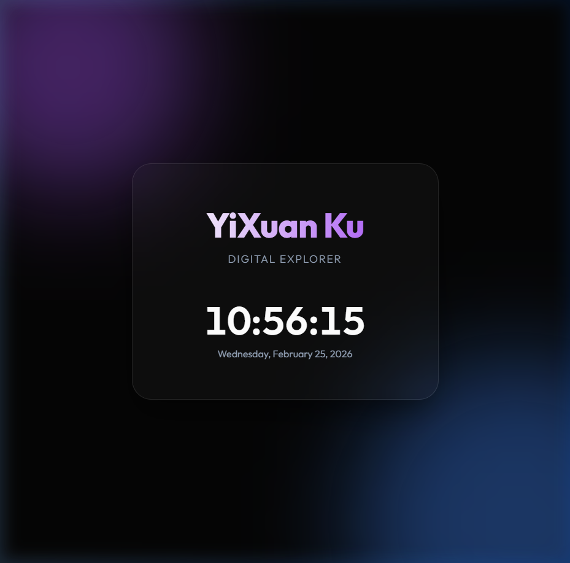

# Project Summary - YiXuan Ku Personal Page

**Date:** February 25, 2026

## 1. Web Development

I designed and built a premium, single-page personal website from scratch.

- **Frontend Architecture**: Created a clean, responsive layout using semantic HTML5.
- **Visual Design**:
  - Implemented a **dark-mode glassmorphism** aesthetic.
  - Added dynamic, animated background blobs with CSS blur filters.
  - Integrated **Google Fonts (Outfit)** for a modern look.
- **Interactivity**:
  - Built a **real-time clock** and date display using JavaScript.
  - Added a **mouse-parallax effect** that makes the profile card tilt based on cursor position.
- **Files Created**:
  - `index.html`: Main structure and SEO meta tags.
  - `style.css`: Modern styling, animations, and transitions.
  - `main.js`: Logic for the clock and interactive UI elements.

## 2. Quality Assurance

- **Browser Preview**: Verified the website's appearance and functionality using an automated browser subagent.
- **Visual Verification**: Captured and reviewed a high-resolution screenshot to ensure the design met "premium" standards.

## 3. Git & GitHub Integration

- **Local Repository**: Initialized a Git repository in the project folder.
- **Configuration**: Set up global/local user identities:
  - User: `4110064003`
  - Email: `xuanku114nchu@gmail.com`
- **Version Control**: Staged all assets and created a detailed initial commit.
- **Remote Setup**: Linked the local repo to `https://github.com/4110064003/PersonalWebPage0225.git`.
- **Troubleshooting**: Identified a credential conflict (403 error) and provided specific solutions to handle GitHub authentication on Windows.

## 4. Documentation & Support

- Provided instructions on how to view the website locally (Start menu, Terminal, or Drag & Drop).

## 5. Final Result

The personal page is now live and fully functional.

- **GitHub Repository**: [https://github.com/4110064003/PersonalWebPage0225](https://github.com/4110064003/PersonalWebPage0225)
- **Preview**:

